# QueryResponse Interface Design and Development Guide Based on REST API in HealthConnect

## Background:
This guideline provides an overview of how to design and implement a REST API interface for querying patient demographic data from an Electronic Patient Record (EPR) system using HealthConnect. The process involves sending a query request with the patient's identification number, retrieving the response from the EPR system, extracting the required patient demographic data from the HL7 message, and sending it as a JSON response to the supplier. The high-level process diagram is shown below (Screenshot 1).

🚨 **Note: You can modify or add code and other features according to your requirements. This is just a basic guideline I’ve created for quick solutions.**

## Screenshot 1: A High-Level Message Process Diagram.
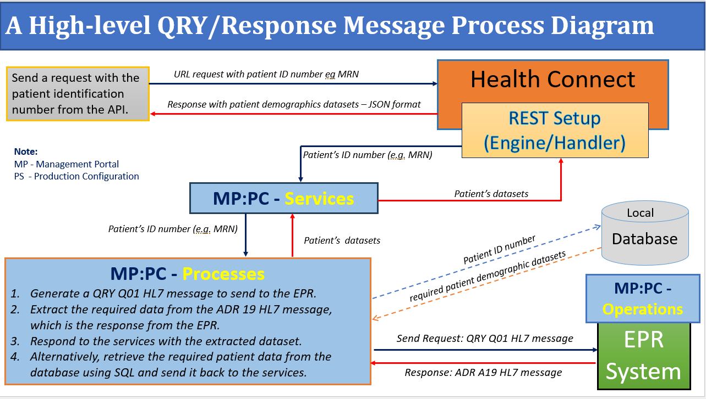

# 🛠️ Usage Instructions
The step-by-step guideline is provided below:
1. Setup HealthConnect Management Portal (MP) – Production Configuration (PC).
2. Custom Code
3. Using Postman

## 🚀 Step 1: Set Up Web Application
## 🏥 Step 2: Set Up the REST Service in HealthConnect Management Portal

1. 🔑 **Navigate to Web Application Setup**  
   Go to: `System Administration → Security → Application → Web Application`.

2. ➕ **Create a New Web Application**  
   - Click **"Create New Web Application"**  
   - Enter the **Name** of the application  
   - Optionally, provide a **Description**  
   - For **Namespace**, select the appropriate namespace  

3. ⚡ **Enable REST**  
   - Click on **REST** to enable the service  
   - Enter the **Dispatch Class**  
   - Select **"Unauthenticated"** (password setup will be explained later)  

4. 💾 **Save Your Configuration**  
   - Click **"Save"**  
   - Refer to **Screenshot 2** for an example  

📸 **Screenshot 2:** Web Application and Setting Up REST
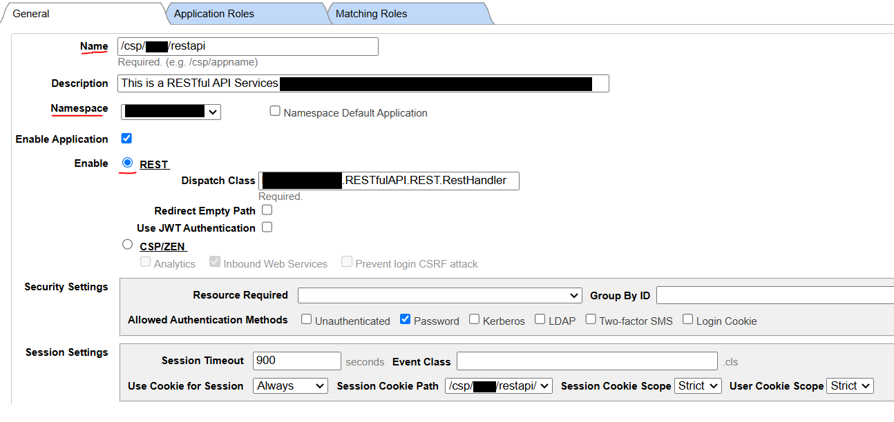

## 🛠️ Step 2: Create Required Classes

### A. Create Class – `GetRequestDatasets`

1. 📂 **Open Cache Studio**  
   - Select the appropriate **namespace** (the one you set up previously).

2. ➕ **Create a New Class**  
   - Go to `File → New → General → Class Definition → OK`.

3. 📝 **Enter Class Details**  
   - **Package Name:** *(your chosen package)*  
   - **Class Name:** `GetRequestDatasets`  

📸 **Screenshot 3:** Code for `GetRequestDatasets`
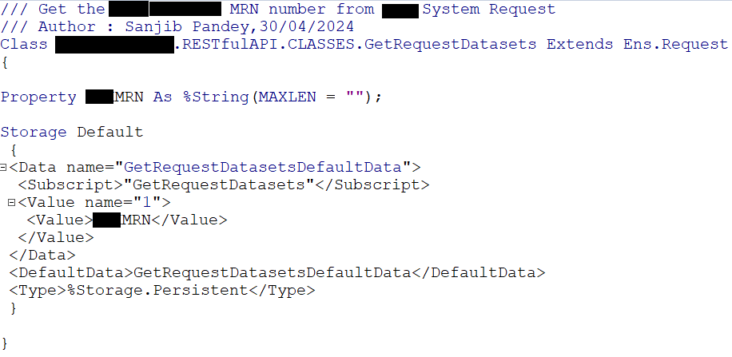

### B. Create Response Datasets Class – `SetResponseDatasets`

⚠️ **Note:** You can add or remove properties according to your requirements.

1. ➕ **Create a New Class**  
   - Class Name: `SetResponseDatasets`  

2. 📝 **Add the Code**  
   - Write the required code for the class  
   - Compile the class  

📸 **Screenshot 4:** Code for `SetResponseDatasets`
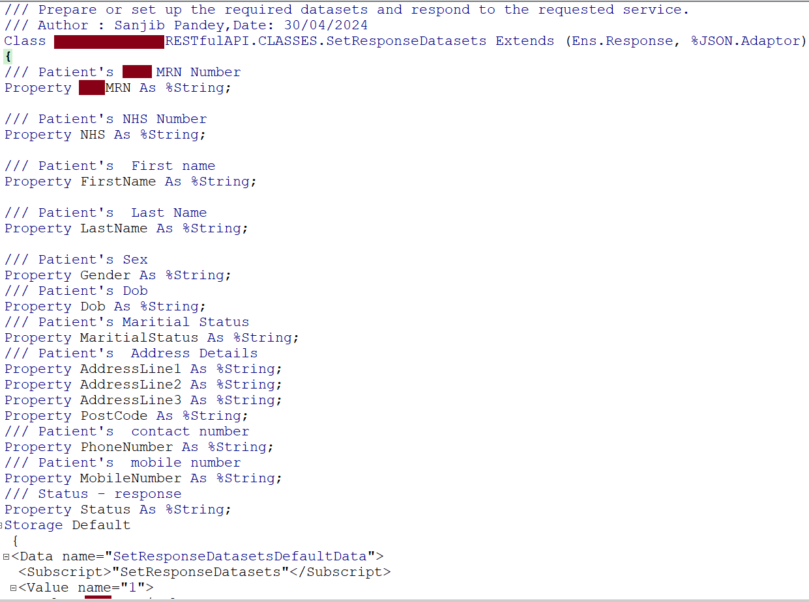

### C. Create Business Process – `QueryRequestResponse`

1. ➕ **Create a New Business Process**  
   - Name: `QueryRequestResponse`  

2. 📝 **Add the Code**  
   - Write the required code for the business process  
   - Compile it  

📸 **Screenshot 5:** Code for Business Process – `QueryRequestResponse`
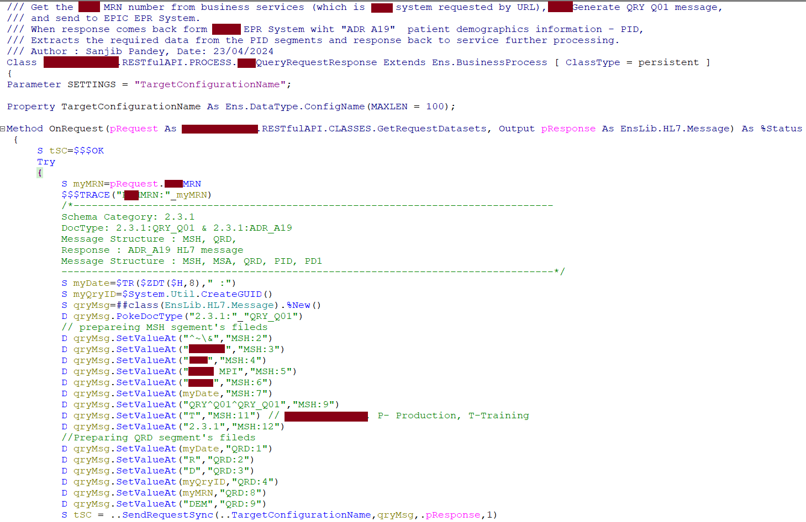

⚠️ **Note:** `"404 Not Found"` is just a display message; you can configure this differently if needed.

### D. Create Business Service – `GetRequest`

1. ➕ **Create a New Business Service**  
   - Name: `GetRequest`  

2. 📝 **Add the Code**  
   - Write the required code for the business service  
   - Compile it  

📸 **Screenshot 6:** Code for Business Service – `GetRequest`
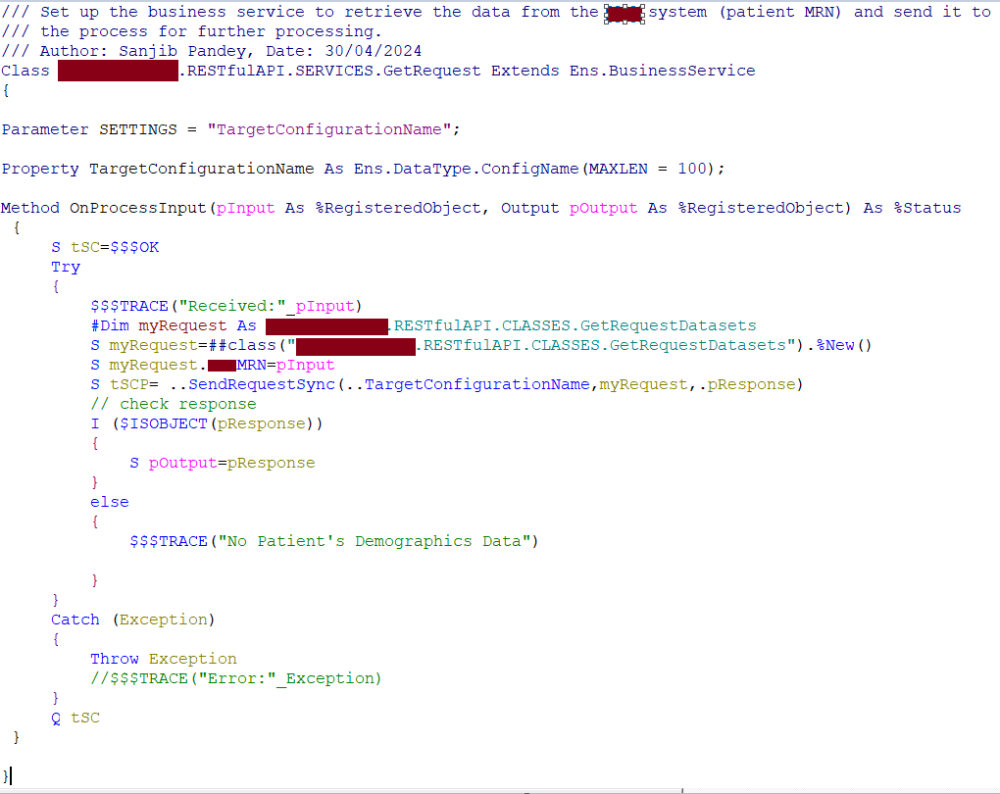

### E. Create REST Handler – `RestHandler`

1. ➕ **Create a New REST Handler**  
   - Name: `RestHandler`  

2. 📝 **Add the Code**  
   - Write the required code for the REST handler  
   - Compile it  

📸 **Screenshot 7:** Code for `RestHandler`
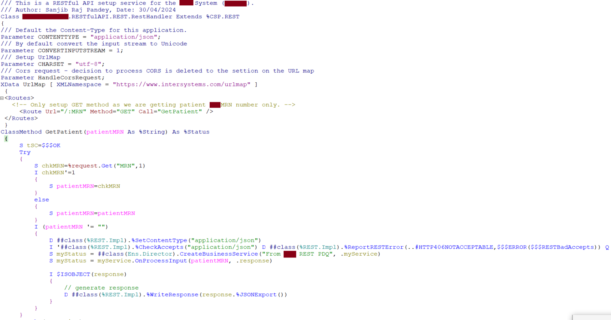

### ✅ Final Layout in Studio

Once all classes, business processes, services, and REST handlers are created and compiled, your **Studio** should display the following layout:

📸 **Screenshot 8:** Studio Layout of RESTful API

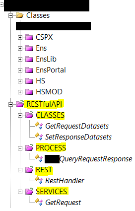

## ⚙️ Step 3: Set Up Management Portal – Production Configuration

Give the names (services, processes, operations) according to your requirements.

1. 🛠️ **Configure Services**  
   - Select the appropriate class: `...RESTfulAPI.SERVICES.GetRequest`

2. 🔄 **Configure Processes**  
   - Select the appropriate class: `...RESTfulAPI.PROCESS.QueryRequestResponse`

3. ⚡ **Configure Operations**  
   - Select: `EnsLib.HL7.Operation.TCPOperation` (for EPR System)

⚠️ **Note:**  
- Go to the service’s settings and select the **process name** from the dropdown list you defined.

📸 **Screenshot 9:** Management Portal – Production Configuration view

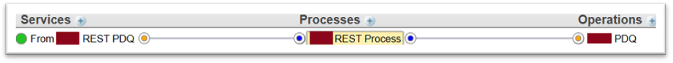

## Finally, we have set up everything. Now, let's test or evaluate the interface.

## 🧪 Step 4: Testing and Evaluation

If you don’t already have it, download and install **Postman** to test the REST interface.

### 🔹 Test Case 1: Request with a Valid Patient MRN

1. 🌐 **Send a GET Request**  
   - URL: `https://......restapi/Patient?MRN=510800`  
   - Method: **GET**  

2. ✅ **Verify the Response**  
   - Check that the returned data matches the patient record for MRN `510800`.  

📸 **Screenshot 10:** Output of Test Case 1

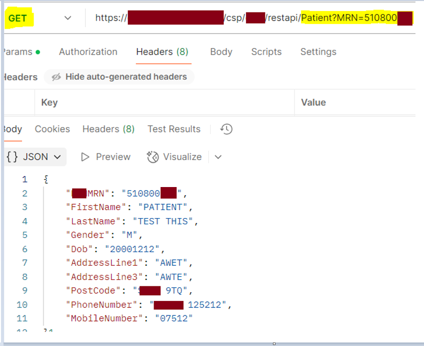

### 🔹 Test Case 2: Request with a Valid Patient MRN (Alternative URL)

1. 🌐 **Send a GET Request**  
   - URL: `https://......restapi/510800`  
   - Method: **GET**  

2. ✅ **Verify the Response**  
   - Ensure the returned data matches the patient record for MRN `510800`.  

📸 **Screenshot 11:** Output of Test Case 2

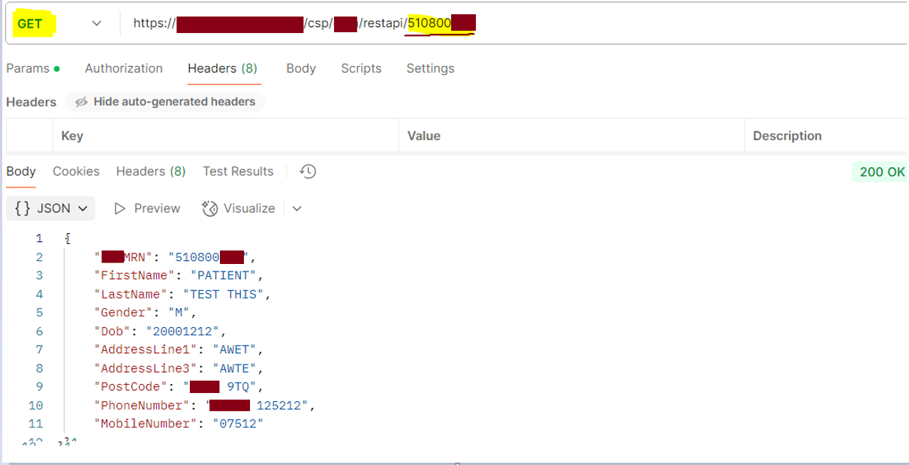

### 🔹 Test Case 3: Request with an Invalid Patient MRN

1. 🌐 **Send a GET Request**  
   - URL: `https://......restapi/Patient?MRN=INVALID_MRN`  
   - Method: **GET**  

2. ⚠️ **Verify the Response**  
   - The system should return an error message or indicate that no record was found.  

📸 **Screenshot 12:** Output of Test Case 3

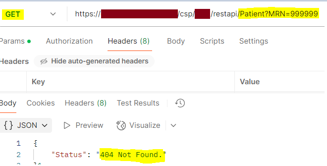

### 🔹 Test Case 4: Management Portal Services Disabled

1. ⚠️ **Scenario**  
   - If the services in the Management Portal are disabled, requests to the REST API will not succeed.  

2. 🌐 **Send a Request**  
   - Try sending a GET request to your REST endpoint.  

3. ❌ **Expected Output**  
   - The system will display a message indicating that the services are disabled.  

📸 **Screenshot 13(a):** Disabled Services – Output of Test Case 4

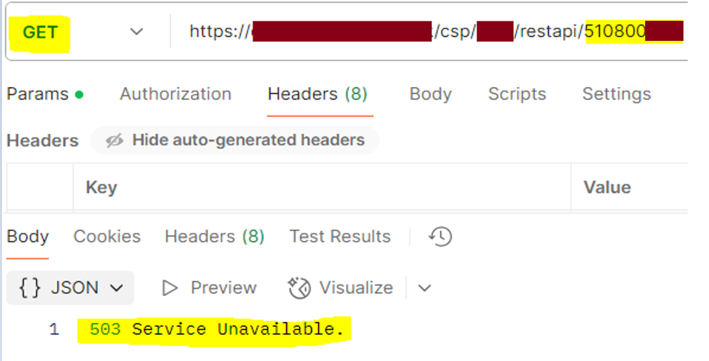

📸 **Screenshot 13(b):** Disabled Services – Additional Output of Test Case 4

### 🔹 Visual Trace of Messages

To better understand the flow of requests and responses, you can view the **message visual trace** in the Studio.

📸 **Screenshot 14:** Visual Trace

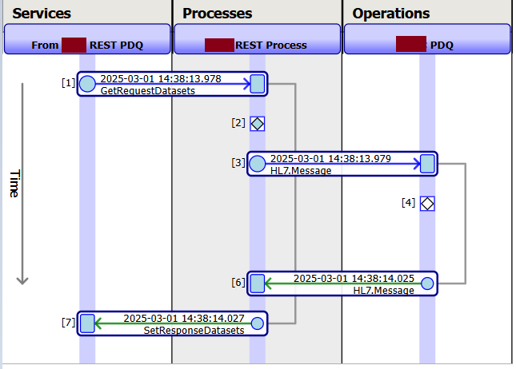

📸 **Screenshot 15:** Source Message

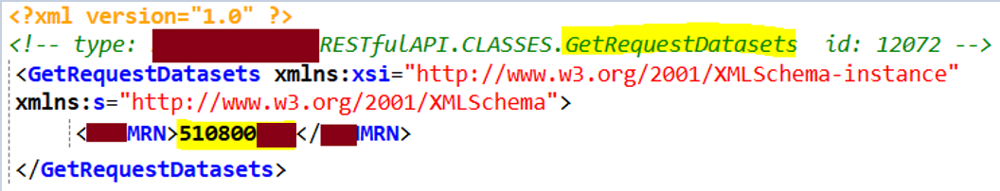

📸 **Screenshot 16:** Process Message – Generate Message

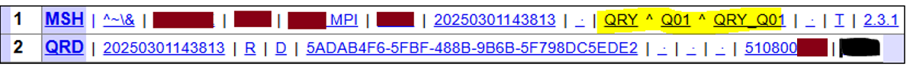

📸 **Screenshot 17:** Response from the EPR System – ADR^A19 

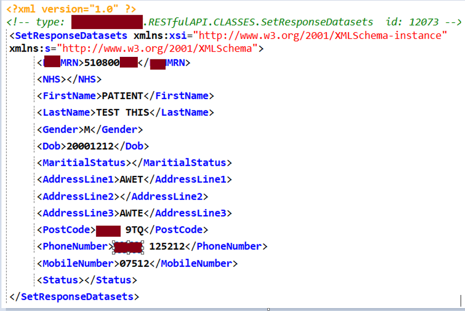

## 🔒 Password Setup for REST API

This section provides a basic method to set up a **username and password** for accessing the REST API configured in HealthConnect.  

> For testing and demonstration purposes, **Postman** is used.

### 1. Initial Unauthorized Access

1. 🌐 **Send a Request Without Credentials**  
   - Attempt to access the REST endpoint using Postman **without a username or password**.  

2. ❌ **Expected Result**  
   - The system will return an **unauthorized error** indicating that authentication is required.

📸 **Screenshot 1:** Unauthorized Access

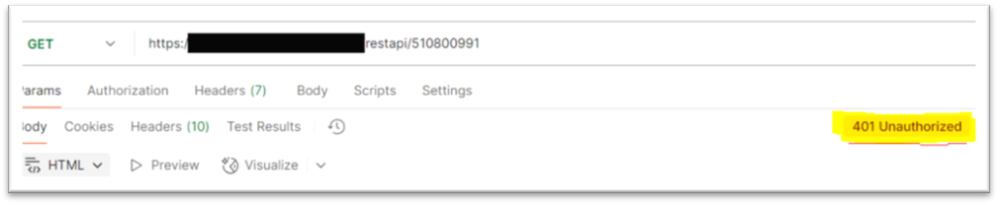

## 👤 Step 1: Create a Limited-Access User Account

1. 🔑 **Navigate to User Management**  
   - Go to: `System Administrator → Security → Users`.

2. ➕ **Create a New User**  
   - Click **"Create New User"**  
   - Enter a **Username** (e.g., `Test`)  
   - Fill in other details: **Name**, **Comment**, etc.  
   - Set a **Password** (e.g., `restTest764`)  
   - Click **Save**  

📸 **Screenshot 2:** Creating a New User

3. 🛡️ **Assign Roles**  
   - Navigate to the **Roles** section  
   - Select the appropriate **%DB_...** role  
   - Click **Assign**  

📸 **Screenshot 3:** Assigning Roles to the User

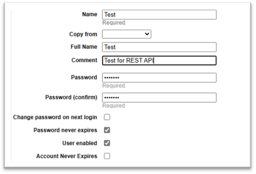

📸 **Screenshot 3:** Assigning Roles to the User

## 🔍 Step 2: Verify the User Account

1. 🔒 **Log Out from the Management Portal**  
   - End your current session as the admin user.

2. 👤 **Log In with the New User**  
   - Use the **username** and **password** you created (e.g., `Test` / `restTest764`).  

3. ✅ **Verify Access**  
   - Ensure the user has **limited access** as per the assigned roles.  
   - Confirm the user can only access the intended REST services and no other administrative functions.

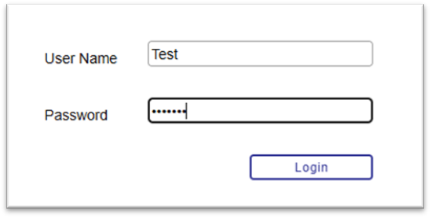

📸 **Screenshot 4:** Limited-Access View for the User

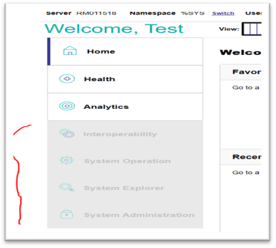

## 🔐 Step 3: Convert Username and Password to BASE64

⚠️ **Note:**  
- The username and password must match the credentials created in the Management Portal.

1. 🌐 **Go to a Base64 Encoder**  
   - Example: [https://base64.guru/converter/encode/text](https://base64.guru/converter/encode/text)

2. 📝 **Enter the Credentials**  
   - Format: `Username:Password`  
   - Example: `Test:Test123`

3. 📄 **Copy the Encoded Value**  
   - This BASE64 value will be used for authorization in Postman or other REST clients.

📸 **Screenshot 5:** BASE64 Encoding of Username and Password

## 🔑 Step 4: Set Up the Password in Postman

1. 💻 **Open Postman**  
   - Launch Postman on your system.

2. ⚙️ **Go to the "Headers" Tab**  

3. 📝 **Enter Authorization Header**  
   - **Key:** `Authorization`  
   - **Value:** `Basic <your_base64_encoded_value>`  

4. 📸 **Reference Screenshot**  
   - See **Screenshot 6** below for guidance.

📸 **Screenshot 6:** Setting Authorization Header in Postman

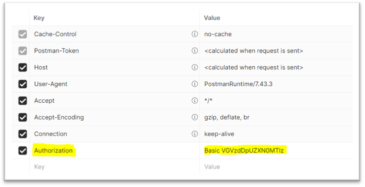

## 🧪 Step 5: Test the REST API with Authenticated User

1. 🌐 **Send the Request in Postman**  
   - Ensure the **Authorization header** is set with your BASE64 credentials.  
   - Use the same endpoint you configured in the Management Portal.

2. ✅ **Verify the Response**  
   - If everything is set up correctly, the REST API will return a valid response.  

3. 📄 **Example Response**  
   - *(This is an example response from a successful request using my setup.)*  

## 🏁 Conclusion: Providing Access to End Users

1. 🔑 **Share the BASE64 Credentials**  
   - Provide the **Base64-encoded username and password** to your end users so they can access the REST API.  

2. ⚠️ **Security Note**  
   - This is a **basic authentication approach** and is **not the most secure** method.  
   - For a more secure authentication approach using **JWT / OAuth2.0**, refer to this InterSystems Community article: [Generate JWT / OAuth2.0 Signature](https://community.intersystems.com/post/generate-jwt-oauth20-signature) 
   - You can read more about JWT in my other article.  

3. 👍 **Final Tip**  
   - Ensure users are aware of their credentials and the limited-access permissions you have set in HealthConnect.  

I hope this guide helps you set up and test your REST API successfully!

